# Panduan Implementasi Upload Google Drive — Inside Booth

Kode untuk melakukan integrasi dan unggah (upload) file ke Google Drive sudah tersedia secara lengkap di dalam workspace Anda. Sistem ini menggunakan arsitektur modern **Next.js API Routes** di backend dan **Vanilla JS** di frontend dengan fitur-fitur premium berikut:

1. **OAuth 2.0 Auth Flow**: Login dengan akun Google pengguna dan menyimpan _refresh token_ dengan aman dalam `httpOnly` cookie untuk masa berlaku 1 tahun.
2. **Dynamic Folder Hierarchy**: Membuat struktur folder secara otomatis di Google Drive berdasarkan tanggal saat ini: `[Folder Utama] -> [Bulan Tahun] -> [Hari Bulan] -> [Nama Folder Sesi]`.
3. **Resumable Upload Protocol**: Menggunakan protokol upload Google Drive _resumable_ untuk mengunggah file berukuran besar secara stabil tanpa kegagalan di jaringan seluler.
4. **Streaming Proxy**: Streaming request body langsung dari browser ke Google Drive tanpa membebani memori RAM server (_no buffering_).
5. **Parallel Uploads & Concurrency Control**: Mengunggah hingga 3 file sekaligus secara paralel dengan antrean (_queue worker_).
6. **Live Progress Tracking**: Menampilkan persentase progress upload keseluruhan secara _real-time_ kepada pengguna.

Berikut adalah penjelasan dan letak file-file kode tersebut di dalam project Anda:

---

## 📐 Arsitektur & Alur Integrasi

Untuk memvisualisasikan bagaimana aplikasi desktop **Tauri (`booth`)** berinteraksi dengan server **Next.js (`inside-booth`)** dan **Google Drive API**, berikut adalah diagram alur data lengkapnya:

```mermaid
sequenceDiagram
    autonumber
    participant Customer as Customer (Browser HP / QR)
    participant Tauri as Tauri Desktop Client (booth)
    participant NextJS as Next.js API Server (inside-booth)
    participant GDrive as Google Drive API

    Note over NextJS, GDrive: 1. Setup OAuth (Admin)
    NextJS->>GDrive: Mengakses url login start/route.ts
    GDrive-->>NextJS: Mengembalikan refresh_token (disimpan di httpOnly Cookie 1 tahun)

    Note over Tauri, NextJS: 2. Sesi Foto Selesai & Pembuatan Folder
    Tauri->>NextJS: POST /api/drive-upload (Kirim nama folder sesi)
    NextJS->>GDrive: Cari/buat folder MonthYear -> DayMonth -> SessionFolder
    GDrive-->>NextJS: Mengembalikan Folder ID & URL Publik
    NextJS-->>Tauri: Mengembalikan folderId & folderUrl

    Note over Tauri, NextJS: 3. Resumable Upload (Streaming Proxy)
    rect rgb(20, 20, 30)
        Tauri->>NextJS: POST /api/drive-upload/resumable (Inisiasi file)
        NextJS->>GDrive: POST /upload/drive/v3/files?uploadType=resumable
        GDrive-->>NextJS: Mengembalikan Session URL Google
        NextJS-->>Tauri: Mengembalikan Session URL Google (melalui proxy)
        Tauri->>NextJS: PUT /api/drive-upload/resumable?sessionUrl=... (Kirim data biner)
        NextJS->>GDrive: PUT Session URL (Streaming payload secara real-time via duplex: 'half')
        GDrive-->>NextJS: Upload selesai (Mengembalikan File ID)
        NextJS-->>Tauri: Mengembalikan sukses response
    end
```



---

## ⚙️ 1. Konfigurasi Lingkungan (`.env`)

Untuk mengaktifkan fitur upload ini, Anda perlu melengkapi variabel lingkungan berikut di file [.env](file:///d:/Coding/portfolio/inside-booth/.env) atau [.env.local](file:///d:/Coding/portfolio/inside-booth/.env.local) (lihat referensi di [.env.example](file:///d:/Coding/portfolio/inside-booth/.env.example)):

```bash
# ID Folder utama Google Drive tempat menampung semua hasil upload
GOOGLE_DRIVE_FOLDER_ID=your_folder_id_here

# Kredensial Google OAuth yang didapat dari Google Cloud Console
GOOGLE_OAUTH_CLIENT_ID=your_client_id_here
GOOGLE_OAUTH_CLIENT_SECRET=your_client_secret_here
GOOGLE_OAUTH_REDIRECT_URI=http://localhost:3000/api/drive-auth/callback
```

---

## 🔐 2. Alur Autentikasi (Google OAuth 2.0)

Autentikasi ini dibutuhkan agar server dapat bertindak atas nama akun Google Drive pengguna untuk membuat folder dan mengunggah foto.

### A. Mulai Login OAuth

File [start/route.ts](file:///d:/Coding/portfolio/inside-booth/app/api/drive-auth/start/route.ts) digunakan untuk membuat link otorisasi Google dengan akses `offline` (agar Google mengembalikan `refresh_token` permanen) dan mengarahkan pengguna ke halaman persetujuan Google.

```typescript
// app/api/drive-auth/start/route.ts
export async function GET() {
  const clientId = getEnv('GOOGLE_OAUTH_CLIENT_ID')
  const clientSecret = getEnv('GOOGLE_OAUTH_CLIENT_SECRET')
  const redirectUri = getEnv('GOOGLE_OAUTH_REDIRECT_URI')

  const oauth2 = new google.auth.OAuth2(clientId, clientSecret, redirectUri)
  const scopes = ['https://www.googleapis.com/auth/drive']
  const url = oauth2.generateAuthUrl({
    access_type: 'offline',
    prompt: 'consent', // Memaksa Google untuk selalu memberikan refresh token baru
    scope: scopes,
  })

  return NextResponse.redirect(url)
}
```

### B. Callback & Menyimpan Cookie Token

File [callback/route.ts](file:///d:/Coding/portfolio/inside-booth/app/api/drive-auth/callback/route.ts) menerima kode otorisasi dari Google setelah login sukses, menukarnya dengan token, lalu menyimpan `refresh_token` di cookie bertipe `httpOnly` dan `secure` untuk masa aktif 1 tahun.

```typescript
// app/api/drive-auth/callback/route.ts
export async function GET(req: Request) {
  const url = new URL(req.url)
  const code = url.searchParams.get('code')
  // ... validasi kode ...
  const { tokens } = await oauth2.getToken(code)
  const refreshToken = tokens.refresh_token

  const baseUrl = new URL(redirectUri).origin
  const response = NextResponse.redirect(new URL('/', baseUrl))

  // Simpan refresh token di cookie httpOnly dengan aman
  response.cookies.set('google_refresh_token', refreshToken, {
    httpOnly: true,
    path: '/',
    sameSite: 'lax',
    secure: process.env.NODE_ENV === 'production',
    maxAge: 60 * 60 * 24 * 365, // 1 tahun
  })
  return response
}
```

### C. Penanganan Token Expired atau Revoked (`invalid_grant`)

Google OAuth refresh token dapat menjadi tidak valid jika pengguna mencabut izin aplikasi di panel Google Account Settings mereka. Ketika ini terjadi, API akan mengembalikan error `invalid_grant`.

Untuk menanganinya secara elegan di backend:
1. Bungkus pemanggilan Drive API dengan blok `try-catch`.
2. Jika terdeteksi error dengan pesan `invalid_grant` atau status `400/401`, hapus cookie `google_refresh_token` di response.
3. Kembalikan respons terstandarisasi agar frontend mengarahkan kembali admin ke halaman login OAuth.

```typescript
try {
  // ... panggil google drive api ...
} catch (error: any) {
  if (error.message?.includes('invalid_grant') || error.response?.status === 400) {
    const response = NextResponse.json(
      { error: 'AUTH_REQUIRED', message: 'Koneksi Google Drive terputus.' },
      { status: 401 }
    );
    response.cookies.delete('google_refresh_token');
    return response;
  }
  // ... handling error lain ...
}
```

---

## 📁 3. Membuat Struktur Folder Otomatis

File [drive-upload/route.ts](file:///d:/Coding/portfolio/inside-booth/app/api/drive-upload/route.ts) dipanggil oleh frontend untuk mempersiapkan folder di Google Drive. Backend akan otomatis mengelompokkan folder berdasarkan waktu lokal:

1. Mencari/membuat folder **Bulan Tahun** (contoh: _Mei 2026_) di dalam folder utama.
2. Mencari/membuat folder **Tanggal** (contoh: _18 Mei_) di dalam folder bulan tersebut.
3. Membuat **Folder Sesi Baru** dengan nama sesuai input pengguna (atau default nomor WA/waktu).
4. Mengembalikan ID folder baru tersebut beserta tautan publiknya (`folderUrl`).

```typescript
// app/api/drive-upload/route.ts
export async function POST(req: Request) {
  // ... Membaca refresh token dari cookie ...
  const oauth2 = new google.auth.OAuth2(clientId, clientSecret, redirectUri)
  oauth2.setCredentials({ refresh_token: rt })
  const drive = google.drive({ version: 'v3', auth: oauth2 })

  // 1. Dapatkan/Buat folder Bulan-Tahun (e.g., "Mei 2026")
  const now = new Date()
  const monthYear = new Intl.DateTimeFormat('id-ID', {
    month: 'long',
    year: 'numeric',
    timeZone: 'Asia/Makassar',
  }).format(now)
  const monthYearFolderId = await findOrCreateFolder(
    drive,
    rootFolderId,
    monthYear,
  )

  // 2. Dapatkan/Buat folder Hari-Bulan (e.g., "18 Mei")
  const dayMonth = new Intl.DateTimeFormat('id-ID', {
    day: 'numeric',
    month: 'long',
    timeZone: 'Asia/Makassar',
  }).format(now)
  const dayMonthFolderId = await findOrCreateFolder(
    drive,
    monthYearFolderId,
    dayMonth,
  )

  // 3. Buat Folder Tujuan Khusus Sesi Ini
  const folderName =
    targetFolderName.trim() || `inside-booth-uploads-${now.toISOString()}`
  const createdFolder = await drive.files.create({
    requestBody: {
      name: folderName,
      mimeType: 'application/vnd.google-apps.folder',
      parents: [dayMonthFolderId],
    },
    fields: 'id,name',
    supportsAllDrives: true,
  })

  const newFolderId = createdFolder.data.id
  const folderUrl = `https://drive.google.com/drive/folders/${newFolderId}`

  return NextResponse.json({ folderId: newFolderId, folderUrl })
}
```

---

## ⚡ 4. Proxy Upload Resumable (Streaming)

Untuk file berukuran besar seperti hasil ekspor foto beresolusi tinggi, project Anda menggunakan **Resumable Upload** yang dibagi menjadi dua langkah di [resumable/route.ts](file:///d:/Coding/portfolio/inside-booth/app/api/drive-upload/resumable/route.ts):

### A. POST - Inisiasi Sesi Upload

Meminta Google Drive untuk membuat sesi upload khusus untuk satu file. Google akan mengembalikan `Location` header yang berisi **Session URL** unik.

```typescript
// app/api/drive-upload/resumable/route.ts (POST)
export async function POST(req: Request) {
  // ... Dapatkan access token baru menggunakan refresh token ...
  const metadata = JSON.stringify({ name: fileName, parents: [folderId] })

  const initiateRes = await fetch(
    'https://www.googleapis.com/upload/drive/v3/files?uploadType=resumable&supportsAllDrives=true',
    {
      method: 'POST',
      headers: {
        Authorization: `Bearer ${accessToken}`,
        'Content-Type': 'application/json; charset=UTF-8',
        'X-Upload-Content-Type': fileMime,
      },
      body: metadata,
    },
  )

  const sessionUrl = initiateRes.headers.get('Location') // Session URL unik dari Google
  return NextResponse.json({ sessionUrl })
}
```

### B. PUT - Streaming Data Langsung (No RAM Buffering)

Frontend mengirimkan data biner mentah melalui request `PUT` ke backend, dan backend langsung mengalirkan (_pipes_) data tersebut secara streaming ke Google Drive tanpa menyimpannya ke memori server terlebih dahulu (`duplex: 'half'`), sehingga server tetap ringan.

```typescript
// app/api/drive-upload/resumable/route.ts (PUT)
export async function PUT(req: Request) {
  const url = new URL(req.url)
  const sessionUrl = url.searchParams.get('sessionUrl') // Google's session URL

  // Stream data langsung ke Google Drive
  const googleRes = await fetch(sessionUrl, {
    method: 'PUT',
    headers: {
      'Content-Type':
        req.headers.get('content-type') || 'application/octet-stream',
    },
    body: req.body, // Request body streaming langsung
    // @ts-expect-error duplex is needed for streaming request bodies in Node.js
    duplex: 'half',
  })

  const data = await googleRes.json()
  return NextResponse.json({ id: data.id, name: data.name })
}
```

---

## 💻 5. Frontend & Kontrol Progress Bar (`frameApp.js`)

Semua interaksi di sisi client diatur di file [frameApp.js](file:///d:/Coding/portfolio/inside-booth/app/lib/frameApp.js#L2400-L2618).
Di sini, client-side melakukan:

1. Memanggil `/api/drive-upload` untuk membuat folder sesi.
2. Membaca semua file gambar di antrean `folderFiles`.
3. Meminta sesi resumable upload untuk masing-masing file.
4. Mengunggah file secara paralel menggunakan worker queue dengan batas maksimal **3 file sekaligus** (`CONCURRENCY = 3`).
5. Menggunakan `XMLHttpRequest` dengan event listener `xhr.upload.onprogress` untuk memantau byte yang terkirim dan menghitung persentase progress keseluruhan secara _real-time_.

### Potongan Penting di Frontend:

```javascript
// app/lib/frameApp.js
async function uploadToDriveWithProgress() {
  // 1. Buat folder di Drive
  const folderRes = await fetch('/api/drive-upload', {
    method: 'POST',
    body: createForm,
  })
  const { folderId, folderUrl } = await folderRes.json()

  // 2. Persiapkan Progress Tracking & Workers
  const total = folderFiles.length
  const CONCURRENCY = 3
  const fileProgress = new Array(total)
    .fill(null)
    .map(() => ({ loaded: 0, total: 0 }))
  let completedCount = 0

  function updateOverallProgress() {
    const totalBytes = fileProgress.reduce((s, p) => s + p.total, 0)
    const loadedBytes = fileProgress.reduce((s, p) => s + p.loaded, 0)
    const pct =
      totalBytes > 0 ? Math.floor((loadedBytes / totalBytes) * 100) : 0
    uploadProgressEl.textContent = `Mengunggah... ${completedCount}/${total} (${pct}%)`
  }

  // 3. Upload File Tunggal dengan XMLHttpRequest untuk progress
  async function uploadSingleFile(file, index) {
    fileProgress[index].total = file.size

    // Dapatkan session URL
    const sessionRes = await fetch('/api/drive-upload/resumable', {
      method: 'POST',
      body: JSON.stringify({
        fileName: file.name,
        mimeType: file.type,
        folderId,
      }),
    })
    const { sessionUrl } = await sessionRes.json()

    // Lakukan streaming biner menggunakan PUT & ukur progress
    const proxyUrl = `/api/drive-upload/resumable?sessionUrl=${encodeURIComponent(sessionUrl)}`
    await new Promise((resolve, reject) => {
      const xhr = new XMLHttpRequest()
      xhr.open('PUT', proxyUrl)

      xhr.upload.onprogress = (evt) => {
        if (evt.lengthComputable) {
          fileProgress[index].loaded = evt.loaded
          fileProgress[index].total = evt.total
          updateOverallProgress()
        }
      }
      xhr.onload = () => {
        if (xhr.status >= 200 && xhr.status < 400) {
          completedCount++
          updateOverallProgress()
          resolve()
        } else {
          reject(new Error('Gagal'))
        }
      }
      xhr.send(file)
    })
  }

  // 4. Queue Worker untuk Concurrency Limit
  const queue = [...folderFiles.map((f, i) => ({ file: f, index: i }))]
  const workers = []
  async function worker() {
    while (queue.length > 0 && !cancelled) {
      const item = queue.shift()
      await uploadSingleFile(item.file, item.index)
    }
  }
  for (let w = 0; w < Math.min(CONCURRENCY, total); w++) {
    workers.push(worker())
  }
  await Promise.all(workers)

  // Selesai! Tampilkan toast sukses berisi link Drive
  showToast(`Upload selesai: ${total} file berhasil diunggah.`, 'success', {
    link: folderUrl,
  })
}
```

---

## 🖥️ 6. Catatan Integrasi Desktop (Tauri) & Lintas Domain (CORS)

Karena workspace utama ini adalah **Tauri (Desktop App)** dan backend API berjalan di **Next.js**, ada dua hal krusial yang wajib diperhatikan saat mengintegrasikan sisi frontend desktop dengan backend server:

### A. Gunakan Absolute URL untuk `fetch` / `XMLHttpRequest`
Di desktop client Tauri, hindari pemanggilan relative URL seperti `fetch('/api/drive-upload')` karena fetch tersebut akan mengarah ke domain lokal internal Tauri (`tauri://localhost`).
* **Solusi**: Tambahkan variabel lingkungan (misalnya `VITE_API_BASE_URL=http://localhost:3000`) di Tauri, dan modifikasi kode upload:
  ```javascript
  const baseUrl = import.meta.env.VITE_API_BASE_URL || 'http://localhost:3000';
  const folderRes = await fetch(`${baseUrl}/api/drive-upload`, { ... });
  ```

### B. Konfigurasi CORS di Next.js (`inside-booth`)
Agar Next.js dapat menerima request dari aplikasi desktop Tauri, tambahkan konfigurasi header CORS pada Next.js API Routes (`app/api/drive-upload/route.ts` dan sejenisnya) untuk mengizinkan origin dari Tauri:
* Origin Tauri pada Windows: `tauri://localhost`
* Origin Tauri pada macOS/Linux: `ipc.localhost` atau `http://tauri.localhost`

Contoh response header CORS di Next.js:
```typescript
const headers = {
  'Access-Control-Allow-Origin': 'tauri://localhost, http://localhost:1420',
  'Access-Control-Allow-Methods': 'GET, POST, PUT, DELETE, OPTIONS',
  'Access-Control-Allow-Headers': 'Content-Type, Authorization',
  'Access-Control-Allow-Credentials': 'true',
};
```

---

## 🚀 Cara Menjalankan Integrasi Ini

1. **Buat Kredensial di Google Cloud Console**:
   - Buat project baru di [Google Developers Console](https://console.developers.google.com/).
   - Aktifkan **Google Drive API**.
   - Konfigurasikan **OAuth Consent Screen** (Pilih tipe _External_, lalu tambahkan email tester).
   - Buat kredensial **OAuth Client ID** bertipe _Web Application_.
   - Tambahkan URI Pengalihan Resmi (_Authorized redirect URI_): `http://localhost:3000/api/drive-auth/callback`.
2. **Lengkapi File `.env`**:
   - Masukkan ID Client, Secret, URI, dan ID Folder Google Drive Anda ke file `.env` lokal Anda.
3. **Mulai Aplikasi Secara Lokal**:
   - Jalankan perintah `npm run dev` atau server dev Next.js Anda.
4. **Alur Penggunaan di Browser**:
   - Klik tombol **Login dengan Google** untuk masuk ke akun Anda. Anda akan diarahkan ke Google untuk verifikasi izin akses Google Drive.
   - Setelah sukses dialihkan kembali ke beranda, tombol upload akan aktif.
   - Masukkan nomor WhatsApp atau nama folder khusus.
   - Ambil foto atau tambahkan gambar ke antrean sidebar, kemudian klik tombol **Kirim** atau **Upload**! Progress bar akan berjalan secara langsung dari `0%` ke `100%`.
